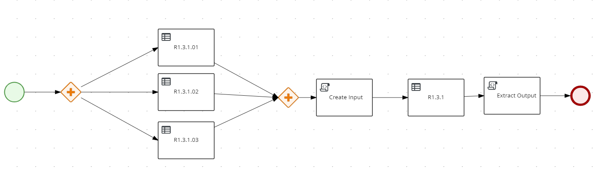

# Large ruleset example

## Description

Example PAM / DM demonstrating how to build large rulesets using BPMN as orchestration and Excel as rule tables

## Top level DMN

<p align="Left"></p>

### Installing and Running

#### Prerequisites

You will need:

* Java 11+ installed
* Environment variable JAVA_HOME set accordingly
* Maven 3.5.2+ installed


#### Compile and Run in Local Dev Mode

```sh
mvn clean compile quarkus:dev
```

## API

```sh
http://localhost:8080/q/swagger-ui/#/Main%20Flow%20Resource/post_MainFlow
```

## Payload

```sh
{
  "a": "Red",
  "b": "Green",
  "c": "Green"
}
```